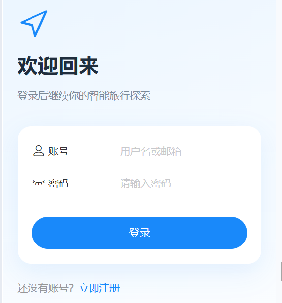
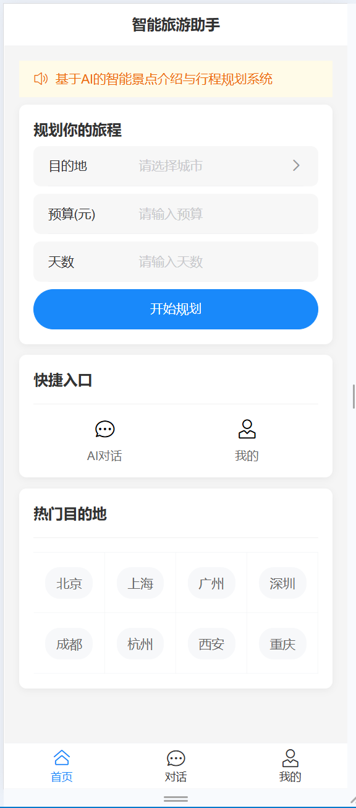
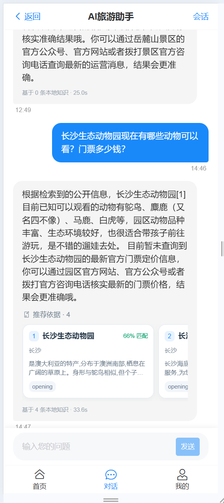
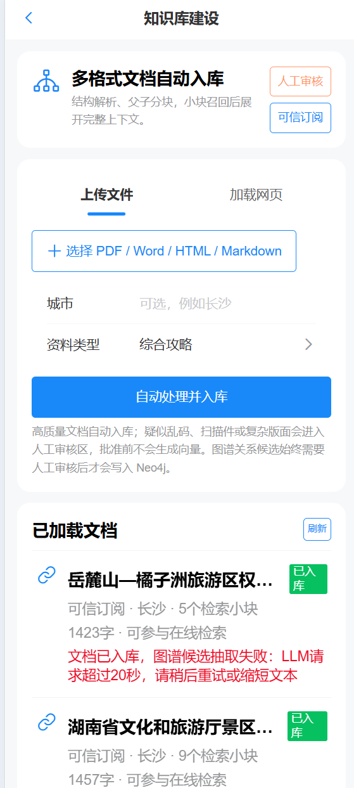

# TravelHelper

面向中文旅游场景的移动端智能助手，支持景点与美食推荐、行程规划、事实关系查询、天气与空气质量查询。系统将本地知识检索、知识图谱和实时数据结合，回答中展示检索过程与资料来源。

## 功能

- 多会话对话与 SSE 流式响应
- 8 类意图识别与 5 条执行路线
- Exact Match、BM25、向量检索及分层 RRF 融合
- Java 规则与 LLM 混合精排，父子 Chunk 上下文扩展
- Qdrant 语义召回与 Neo4j 确定性关系查询
- PDF、DOCX、HTML、Markdown、TXT 文档入库
- 可信网页订阅与增量刷新
- Open-Meteo 天气、空气质量实时查询

## 技术栈

| 模块 | 技术 |
| --- | --- |
| 前端 | Vue 3、TypeScript、Pinia、Vue Router、Vant 4、Vite |
| 后端 | Spring Boot、Java、Spring Security、Spring Data JPA、OkHttp |
| 检索 | Qdrant、BM25、RRF、Embedding |
| 数据 | MySQL、Neo4j |
| 文档解析 | Apache Tika、PDFBox、Apache POI、Jsoup |
| 模型与工具 | 火山方舟、Open-Meteo |

## 核心链路

```text
离线：文档/网页 → 质量检查 → 文本清洗 → 结构化父子切片 → Embedding → Qdrant/MySQL

在线：用户问题 → 意图与路由 → 精确匹配/关键词/向量召回 → RRF → 精排
     → Neo4j关系补充/实时工具 → 父Chunk上下文 → 带引用流式回答
```

## 项目结构

```text
travelHelper_frontend/   Vue 移动端应用
travelHelper_server/     Spring Boot 服务
docker-compose.yml       MySQL、Qdrant、Neo4j 本地依赖
```

## 本地运行

环境要求：Java 21、Node.js 20+、Docker。

1. 复制 `.env.example` 为 `.env`，填写火山方舟 API Key 和模型接入点。
2. 执行 `docker compose up -d` 启动 MySQL、Qdrant 和 Neo4j。
3. 在 `travelHelper_server` 下执行 `./mvnw spring-boot:run`。
4. 在 `travelHelper_frontend` 下执行 `npm install` 和 `npm run dev`。

## 界面展示
登录页面：


首页管理：


聊天管理：


多会话管理：


知识管理：


## 配置说明

API Key 只通过环境变量传入。仓库不包含本地数据库、向量数据、运行日志、IDE 配置及测试代码。
